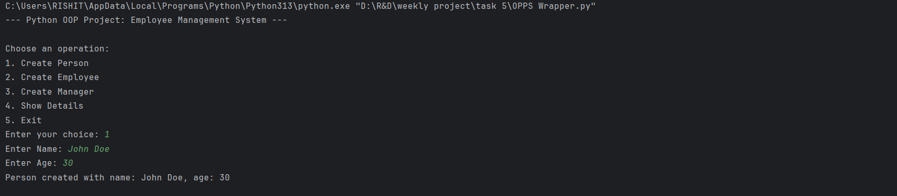
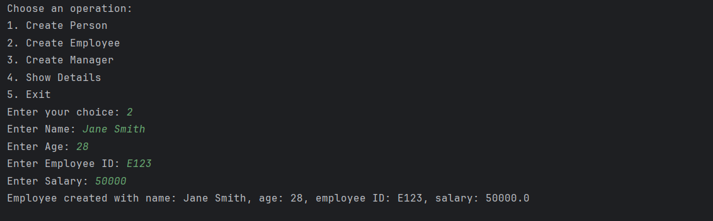
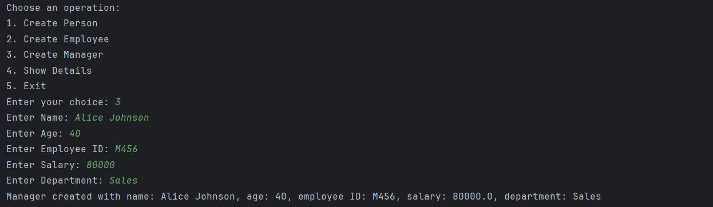
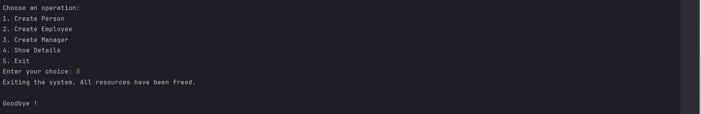

# Employee Management System

## Project Description

This project is a simple Employee Management System developed using Python and Object-Oriented Programming (OOP) concepts. The system allows users to create and manage Person, Employee, and Manager records through a menu-driven interface.

The project demonstrates important OOP concepts such as inheritance, encapsulation, method overriding, constructors, getters, setters, and the use of the `super()` function.

---

## Features

* Create Person records
* Create Employee records
* Create Manager records
* Display Person details
* Display Employee details
* Display Manager details
* Menu-driven user interface
* Encapsulation using private attributes
* Getter and Setter methods

---

## OOP Concepts Used

### 1. Inheritance

* Employee inherits from Person
* Manager inherits from Employee

### 2. Encapsulation

Private attributes:

* `__emp_id`
* `__salary`

### 3. Getter and Setter Methods

Used to access and modify private data safely.

### 4. Method Overriding

The `display()` method is overridden in Employee and Manager classes.

### 5. Constructor

The `__init__()` constructor is used to initialize object attributes.

### 6. super()

Used to call parent class constructors and methods.

---

## Class Structure

Person
│
└── Employee
│
└── Manager

---

## Menu Options

1. Create Person
2. Create Employee
3. Create Manager
4. Show Details
5. Exit

---
## Demo Video

Watch the complete working demonstration of the Employee Management System:

[▶ Click Here to Watch the Demo](https://drive.google.com/file/d/1loSK56K6AvZYR7thS-esKG9awCV-IEji/view?usp=sharing)

## Outputs

### Output-1:


### Output-2: 


### Output-3: 


### Output-4:


### Output-5:   

```


---

## Technologies Used

* Python 3
* Object-Oriented Programming (OOP)

---

## Author

Rishit Rajput
